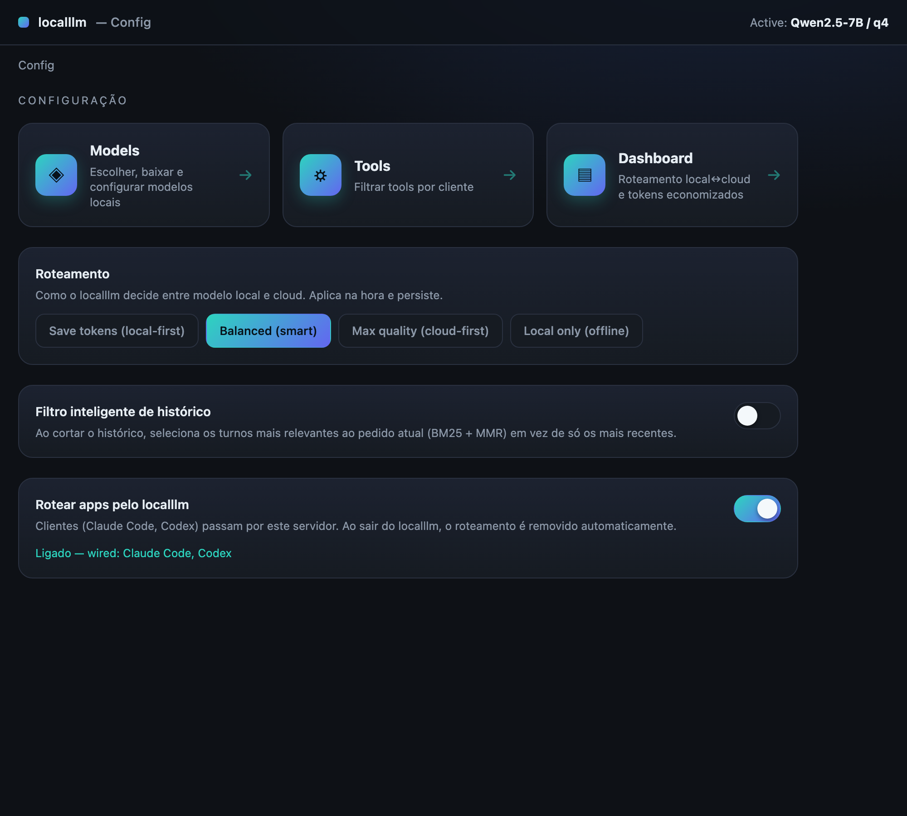
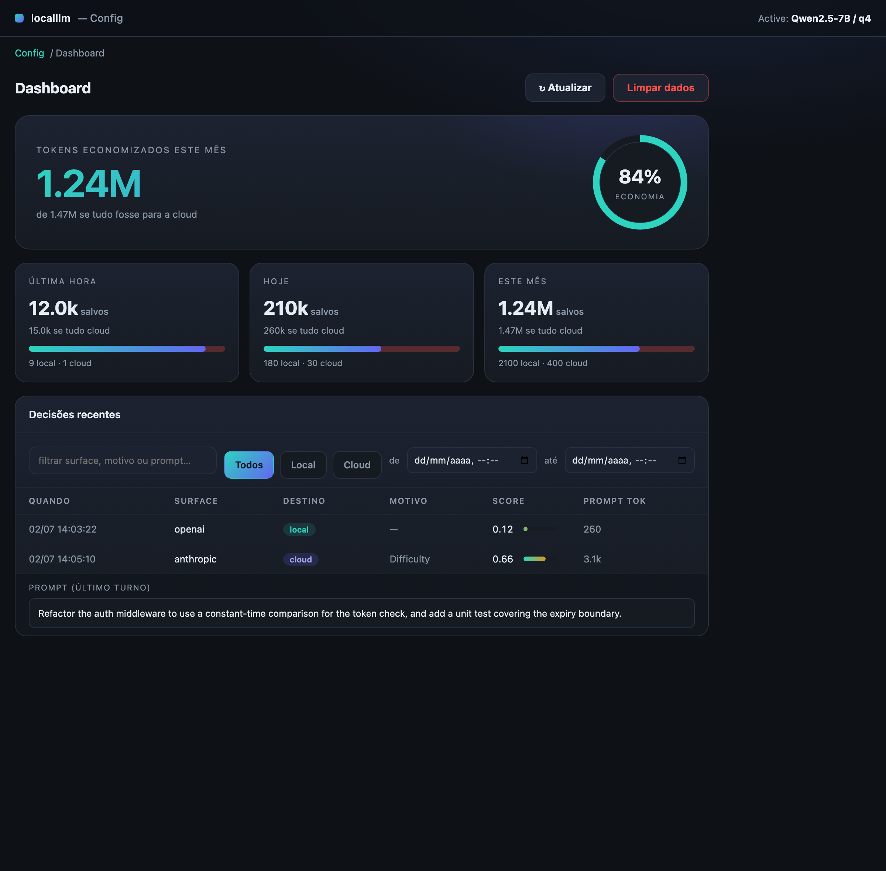
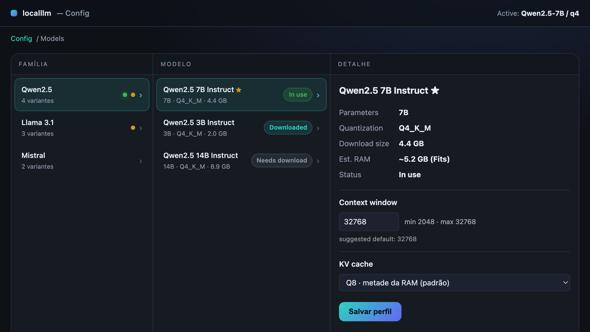
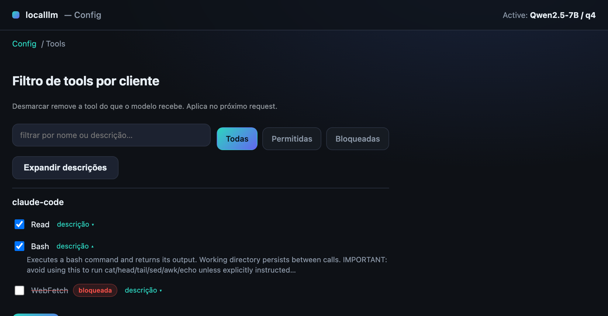

# localllm

A **local-first LLM gateway** for your Mac. It runs a local model, exposes the
OpenAI and Anthropic APIs so existing AI tools can point at it unchanged, and
**routes each request local-vs-cloud on the fly** — keeping cheap/easy work on
the local model and escalating the hard stuff to the cloud provider using the
caller's own credentials. It ships as a macOS **menu-bar app** with a built-in
**Config** UI (model picker, tool filter, routing, dashboard).

The goal: cut cloud token spend without giving up quality — trivial turns stay
local and free, difficult turns still get a frontier model.

---

## Highlights

- **Two API surfaces** — OpenAI (`/v1/chat/completions`, `/v1/responses`,
  `/v1/models`) and Anthropic (`/v1/messages`), with tool calling + SSE streaming.
- **Smart routing** — a cheap pre-generation score decides local vs cloud per
  request; a hard context gate sends over-window prompts to cloud; optional
  cascade escalates a weak local answer.
- **Local engine** — embedded **llama.cpp** (default) on the Apple GPU (Metal),
  with KV-cache quantization and on-disk prefix-cache persistence. `mistralrs`
  is available as an alternate backend.
- **Menu-bar app** — status, live model, and a webview **Config** window:
  Models · Tools · Dashboard, plus routing profile, app wiring, and the smart
  history toggle. Opens on the last-used model; hides on blur to save memory.
- **Dashboard** — persistent routing log: where each prompt went and *why*
  (score breakdown), tokens saved per hour/day/month, and what it would have
  cost if everything went to cloud.
- **Per-model profiles** — context window, KV-cache type, GPU layers, history
  turns, and quant variant, persisted per model and restored on switch.
- **Tool filter** — per-client allow/block list applied at request time.
- **Auto-wiring** — one toggle points Claude Code / Codex at localllm and
  reverts them on quit.

---

## Install

**One-liner (auto-detects your GPU and installs the right build):**

- macOS / Linux:
  ```bash
  curl -fsSL https://raw.githubusercontent.com/rzorzal/localllm/main/scripts/install.sh | bash
  ```
- Windows (PowerShell):
  ```powershell
  irm https://raw.githubusercontent.com/rzorzal/localllm/main/scripts/install.ps1 | iex
  ```

The scripts install user-local (no admin): `~/Applications` (macOS),
`~/.local/bin` (Linux), `%LOCALAPPDATA%\localllm` + your user PATH (Windows).
The binaries are unsigned — on macOS right-click the app → **Open**; on Windows
choose **More info → Run anyway** if SmartScreen warns.

**Or pick the download manually** from the [Releases page](https://github.com/rzorzal/localllm/releases):

| Your machine | Download |
|---|---|
| macOS (Apple Silicon) | `localllm-<ver>-macos-arm64.zip` (Metal) |
| Linux + Nvidia (Ampere / RTX 30xx and newer) | `localllm-<ver>-linux-x64-cuda.tar.gz` |
| Linux (older/no Nvidia GPU) | `localllm-<ver>-linux-x64-cpu.tar.gz` |
| Windows + Nvidia (Ampere / RTX 30xx and newer) | `localllm-<ver>-windows-x64-cuda.zip` |
| Windows (older/no Nvidia GPU) | `localllm-<ver>-windows-x64-cpu.zip` |

The CUDA builds target compute capability 8.0 (Ampere). On older Nvidia cards
(Turing/Pascal) use the CPU build. The GPU backend is chosen at build time —
there is no runtime auto-switch — so download the row that matches your machine.

> The `curl … | bash` / `irm … | iex` URLs point at `main`; they work once this
> branch is merged to `main` and a release has been published.

---

## Screenshots

**Config** — the hub: model picker, tools, dashboard, routing profile, smart-history toggle, and app wiring.



**Dashboard** — tokens saved (hour/day/month), local↔cloud split, and a filterable decisions table. Click a score for the calc breakdown; click a row for the prompt.



**Models** — Firestore-style drilldown (Family → Model → Detail) with per-model context, KV-cache, GPU layers, history, and quant.



**Tools** — per-client allow/block list with text + status filters and collapsible descriptions.



---

## How routing works

For every request localllm computes cheap signals (no generation) and decides:

1. **Context gate** — if the prompt exceeds `ctx_len × ctx_gate_frac`, it can't
   fit locally → **cloud** (`ContextOverflow`). No creds/cloud disallowed →
   local, best-effort.
2. **Difficulty score** in `[0,1]` from the *latest turn* size and conversation
   depth: `0.8·min(1, last_turn_tok/2000) + 0.2·min(1, n_messages/20)`. It
   deliberately ignores the big static prefix/tool schemas agents resend every
   turn, so a trivial `ls` doesn't score like a refactor.
3. If `score > threshold` (the profile's cutoff, adjusted for the local model's
   capability) → **cloud** (`Difficulty`); otherwise **local**, with an optional
   **cascade** to cloud if the local answer comes back weak (length-truncated).

Cloud requests are reverse-proxied to the provider with the caller's own
`x-api-key` / `authorization` header. If the cloud call fails (auth/quota/
offline), it **degrades** to local and notifies once.

### Routing profiles

Selectable live from the Config page (persisted). Lower threshold = more cloud.

| Profile | Threshold | Cascade | Cloud | Behavior |
|---|---|---|---|---|
| **Save tokens** (default) | 0.90 | yes | yes | Local-first; cloud only when local truly can't serve |
| **Balanced** | 0.45 | yes | yes | Local for easy/medium, cloud for harder turns |
| **Max quality** | 0.20 | no | yes | Cloud-first; local only for trivial calls |
| **Local only** | 1.00 | no | no | Never cloud; zero tokens |

---

## Build

```bash
cargo build --release
```

Default backend is embedded **llama.cpp** — no special toolchain needed. The
optional `mistralrs` backend uses Metal GPU shaders; if you build/run it and hit
`missing Metal Toolchain`, install it:

```bash
xcodebuild -runFirstLaunch
xcodebuild -downloadComponent MetalToolchain
# or build CPU-only: MISTRALRS_METAL_PRECOMPILE=0 … --force-cpu true
```

### macOS menu-bar app

```bash
bash scripts/build-app.sh      # produces target/localllm.app
```

Launch the `.app` (menu-bar agent, no Dock icon). It starts the server in the
background and shows a status-bar menu.

---

## Run

Headless server:

```bash
./target/release/localllm --port 31415
```

Menu-bar app (from a terminal):

```bash
./target/release/localllm --tray
```

First run downloads the model to the HuggingFace cache, then loads it. Boot
restores the **last activated model** unless `--model-id` is passed explicitly.

### CLI options

| Flag | Default | Description |
|------|---------|-------------|
| `--port` | `31415` | TCP port (binds `127.0.0.1` only) |
| `--model-id` | `Qwen/Qwen2.5-3B-Instruct-GGUF` | HuggingFace GGUF repo |
| `--gguf-file` | `qwen2.5-3b-instruct-q4_k_m.gguf` | GGUF filename(s); repeat for split models |
| `--ctx-len` | `32768` | Context window in tokens (sizes the KV cache) |
| `--backend` | `llama` | `llama` (embedded llama.cpp) |
| `--kv-type` | `q8` | KV-cache quant: `q8` (½ RAM), `f16` (max quality), `q4` (min RAM) |
| `--kv-cache-dir` | `<cache>/localllm/kvcache` | On-disk prefix-cache dir |
| `--no-kv-persist` | `false` | Disable on-disk KV persistence |
| `--profile` | *(saved)* | Routing profile for this run (`save-tokens`, `balanced`, `max-quality`, `local-only`) |
| `--cloud-token-alert` | `200000` | Session cloud prompt-token total that fires a one-shot high-usage alert |
| `--admin-token` | *(random)* | Token for `/admin/*`; else generated + written to `<config>/localllm/admin-token` (0600) |
| `--force-cpu` | `false` | Force CPU instead of the Apple GPU |
| `--no-paged-attn` | `false` | Disable PagedAttention (mistralrs) |
| `--tray` | `false` | Run as a macOS menu-bar app |

---

## Pointing AI tools at localllm

Manual:

```bash
# Codex CLI
export OPENAI_BASE_URL=http://localhost:31415/v1
codex "explain this code"

# Claude Code
ANTHROPIC_BASE_URL=http://localhost:31415 ANTHROPIC_API_KEY=<your-key> claude
```

Or use the **Config → "Rotear apps pelo localllm"** toggle (or the tray state
line): it rewrites the Claude Code / Codex client configs to point at localllm,
and **un-wires them automatically when you quit** so the tools fall back to the
provider directly.

> Cloud escalation forwards the caller's real API key. Point tools at localllm
> with your normal provider key and localllm decides per request whether to
> answer locally (free) or relay to the provider (your key, your bill).

> **Claude Code note.** It sends a ~26k-token system+tools prefix every turn, so
> keep `--ctx-len 32768`. On a 16 GB Mac the model + KV cache + your apps can
> swap; a smaller model or more RAM helps. Simple clients run great.

---

## The Config app

Opened from the tray (**Config**, or its Models / Tools / Dashboard items), a
single webview reused across sections (hash routes `#/config`, `#/models`,
`#/tools`, `#/dashboard`).

- **Models** — a column drilldown (Family → Model → Detail). Switch models,
  download quant variants, and set per-model **context window, KV-cache type,
  GPU layers, history turns, and quant** — persisted per model.
- **Tools** — per-client tool allow/block list with text + status filters and
  collapsible descriptions. Blocked tools stay blocked (and listed) even when an
  agent stops sending them; discovered tools accumulate and survive restart.
- **Dashboard** — routing rollups + a recent-decisions table (date/time,
  surface, destination, reason, score, tokens). Click a score for the **calc
  breakdown** (why it routed); click a row to see the latest-turn **prompt**.
  Filter by text, destination, and date/time. Clear/refresh actions included.
- **Roteamento** — routing profile selector (applies live, persists).
- **Filtro inteligente de histórico** — global toggle (below).

---

## Dashboard & routing log

Every routing decision is appended as one JSON line to
`<config>/localllm/routing-log.jsonl` (`ts, surface, dest, reason, score,
prompt_tok`, plus the score breakdown and a truncated latest-turn prompt
snippet). Old lines are pruned (~30 days) on boot; the plain-text app log is
size-capped.

- **Tokens saved** = prompt(+completion) of requests served **locally**.
- **If all cloud** = the same for **all** requests (the hypothetical bill).
- Rolled up per **hour / day / month**; served via `GET /admin/dashboard`.

---

## Smart history filter

When history is trimmed to a model's `history_turns` budget, the default keeps
the most **recent** turns. Toggle **Filtro inteligente de histórico** (global,
Config page, default off) to instead select the most **relevant** turns to the
current ask:

- **BM25** lexical relevance to the latest turn + recency, re-ranked with
  **MMR** for diversity. Pure Rust, zero deps, deterministic.
- Always pins the system prompt and the latest turn, re-sorts kept turns
  chronologically, and trims to exactly N.

Research + alternatives (incl. `model2vec` static embeddings) are in
`docs/superpowers/specs/2026-07-02-smart-history-filter-research.md`.

---

## API examples

```bash
# OpenAI
curl http://localhost:31415/v1/chat/completions \
  -H "Content-Type: application/json" \
  -d '{"model":"local","messages":[{"role":"user","content":"Hello!"}],"max_tokens":128}'

# Anthropic
curl http://localhost:31415/v1/messages \
  -H "Content-Type: application/json" \
  -d '{"model":"local","max_tokens":128,"messages":[{"role":"user","content":"Hello!"}]}'

# Health
curl http://localhost:31415/health   # {"status":"ok"}
```

Both APIs support function calling with two-step chaining. Streaming requests
that carry tools use a buffered path (generated in full, replayed as correct SSE
— `tool_calls` for OpenAI, `tool_use` blocks for Anthropic); tool-less streaming
is token-by-token.

```bash
bash scripts/test_openai_tools.sh
bash scripts/test_anthropic_tools.sh
```

### Admin API (token-guarded via `x-admin-token`)

Used by the Config UI; all under `/admin`:

| Endpoint | Purpose |
|---|---|
| `POST /admin/model`, `GET /admin/model/status` | switch model / progress |
| `GET/DELETE /admin/models` | annotated catalog / delete a downloaded model |
| `POST /admin/model/ctx`, `POST /admin/model/profile` | per-model ctx / exec profile |
| `GET/POST /admin/tools` | per-surface discovered tools + blocklist |
| `GET/POST /admin/routing` | routing profile |
| `GET/POST /admin/integrations` | app wiring state / toggle |
| `GET/POST /admin/history-filter` | smart-history toggle |
| `GET/DELETE /admin/dashboard` | rollups + recent / clear log |

---

## Choosing a model and context size

Two levers on a 16 GB Mac: **model size** (bigger = smarter, slower, more RAM)
and **`--ctx-len`** (bigger = longer input, more KV-cache RAM; `q8` KV ≈ half of
`f16`). The tokenizer repo is derived by stripping `-GGUF` from `--model-id`, so
any `Qwen/…-GGUF` repo works out of the box. You can also switch models and quant
variants live from the Config app.

```bash
# Light + fast (default): Qwen2.5-3B
./target/release/localllm

# Smarter: Qwen2.5-7B (split GGUF)
hf download Qwen/Qwen2.5-7B-Instruct-GGUF \
  qwen2.5-7b-instruct-q4_k_m-00001-of-00002.gguf \
  qwen2.5-7b-instruct-q4_k_m-00002-of-00002.gguf
./target/release/localllm \
  --model-id Qwen/Qwen2.5-7B-Instruct-GGUF \
  --gguf-file qwen2.5-7b-instruct-q4_k_m-00001-of-00002.gguf \
  --gguf-file qwen2.5-7b-instruct-q4_k_m-00002-of-00002.gguf
```

---

## Optimizations (llama.cpp backend)

| Optimization | Status | Notes |
|---|---|---|
| GGUF Q4_K_M weights | **ACTIVE** | mmap-loaded |
| Metal GPU acceleration | **ACTIVE** | Apple GPU; `--force-cpu` to disable |
| KV-cache quantization | **ACTIVE** | `--kv-type q8`/`q4`/`f16` |
| Prefix caching (in-process) | **ACTIVE** | Reuses shared prompt prefixes |
| On-disk KV persistence | **ACTIVE** | Prefix state saved under `<cache>/localllm/kvcache` (`--no-kv-persist` off) |
| Flash Attention | **UNAVAILABLE** | CUDA-only; Metal uses its own kernels |

The `mistralrs` backend adds PagedAttention (GPU-only) but does not expose
KV-cache quantization.

---

## Persistence

Settings live at `<config>/localllm/settings.json` (macOS:
`~/Library/Application Support/localllm/`), overridable via `LOCALLLM_SETTINGS`:
routing profile, integration wiring, per-model exec profiles, tool block/seen
lists, active model, and the smart-history toggle. Routing history is
`routing-log.jsonl` in the same dir (`LOCALLLM_ROUTE_LOG` to override).

---

## Logging

Every request logs a short id so concurrent prompts are easy to follow, plus a
`route:` line explaining each decision (score, threshold, signals):

```
req-1a2b3c4d route: Cloud(Difficulty) score=0.66 threshold=0.45 (last_turn_tok=1600 msgs=2 …)
req-1a2b3c4d [anthropic] done: finish=ToolCalls completion_tok=20 0.9s 22.1 tok/s
```

Control verbosity with `RUST_LOG=localllm=info` (or `debug`). File log path:
`LOCALLLM_LOG` (default `/tmp/localllm.log`).

---

## Project layout

```
src/
  main.rs            CLI entry; boot model resolution
  lib.rs             server wiring, test helpers
  server.rs          axum routes, routing decision, admin API
  route/             local-vs-cloud decision (pure) + profiles
  cloud.rs           provider reverse-proxy + degrade
  engine_llama.rs    llama.cpp backend      engine.rs / mistralrs
  model_manager.rs   hot-swappable model + switch state machine
  catalog*.rs        model catalog, quant variants, fit verdicts
  history_select.rs  smart history selection (BM25 + MMR)
  route_log.rs       routing-log JSONL + dashboard rollups
  settings.rs        persisted settings
  integrations/      Claude Code / Codex auto-wiring
  tray.rs            macOS menu-bar app + Config webview
  manager_ui/        Config SPA (vanilla JS)
docs/superpowers/    specs & plans
```

---

## Testing

```bash
cargo test                       # full suite
cargo test --lib route::         # routing decision
cargo test --lib history_select  # smart history
cargo test --test http           # API/admin integration
```

> Note: a few settings tests can flake under the full parallel `cargo test` due
> to a shared `LOCALLLM_SETTINGS` env var; they pass when run per-module
> (`cargo test --lib settings::`).

---

## Model

**Qwen2.5-3B-Instruct-GGUF** (Q4_K_M) by default —
[HF](https://huggingface.co/Qwen/Qwen2.5-3B-Instruct-GGUF). Native context
32,768; strong tool-calling for its size. Switch to any `Qwen/…-GGUF` (or other
GGUF) from the CLI or the Config app.
